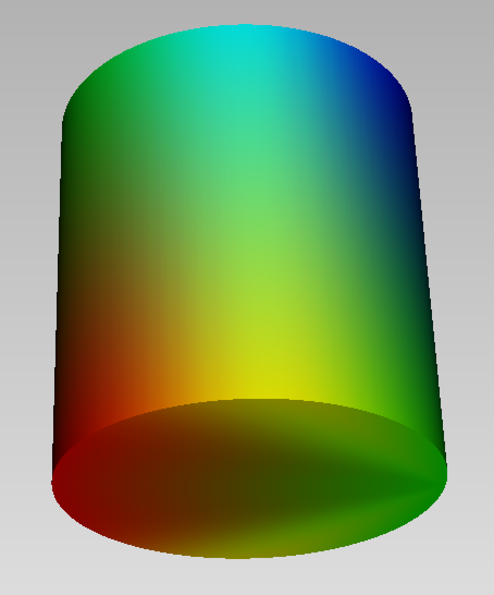

# Attributes

The attributes of a geometric object are

- `color::Color`: a [color](@ref Color) given by its rgb components
- `size::Color`: a number (`::Float64`) indicatingthe size of points or of a curve 
- `field`: a function, a type or an array describing a [field](@ref Fields) on the object. 

They are attributed by providing `key=value` parameters in the construction of the object or
by assignement
```
obj[:key]=value
```

## Color

```@docs
Color
```
Here is an example of a sphere, with the attribute `color` set to the red color.
```jldoctest
S = sphere(point(0.,1.,0.), 0.5, color=Color(255,0,0))
```


## Fields

```@docs
DirField
```

Here is an example of a cylinder, with a directional field for the direction [1,1,0].
```jldoctest
C = cylinder(point(0.,0.,0.), point(0.,1.,0.), 0.5, field=DirField(1.,1.,0.))
```



```@docs
DistField
```

```jldoctest
C = cone(point(0.,0.,0.), point(0.,1.,0.), 0.5, field=DistField(0.5,0.,0.))
```


A field can also be described by an array of values, attached for instance to the vertices of a mesh.    
```jldoctest
C = cube(point(0.,0.,0.), 0.5, field=[Float64(i) for i in 1:8])
```

