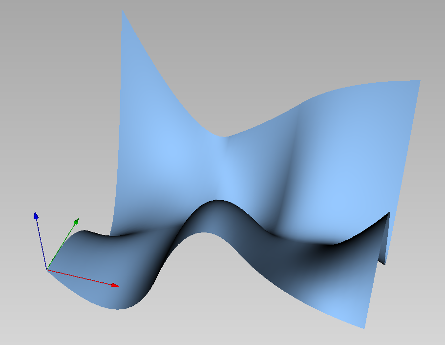

# Axl.jl

The package allows to vizualise geometric objects with [Axl](http://axl.inria.fr/). It depends on the package `SemiAlgebraictypes.jl`, which provides the geometric objects.

## Geometric objects

The package handles the following types:

- point, line, sphere, cylinder, cone, ellipsoid
- mesh with normals, fields
- bspline curves, surfaces, volumes
- parametric curves and surfaces visualized via a mesh 


## Installation 
To use this package, `julia` needs first to be installed (see [here](https://julialang.org/downloads/)).

The package can then be installed from `Julia` as follows:
```
]  # key to switch to the pkg mode
add https://github.com/AlgebraicGeometricModeling/Axl.jl
build Axl
```
This installation checks that `axl` is installed. If not, a warning message with instructions to install it is printed. 
See [here](http://axl.inria.fr/installation.html) more details on how to install `axl`.

## Using `Axl.jl`
Here is an example with a cylinder, a cone and a mesh:
```julia
using SemiAlgebraicTypes, Axl

@axl start
@axl A = point(0.,0.5,0.)
@axl B = point(0.,1.5,0.)
C = point(0.,3.5,0.)

c0 = cylinder(A,B,0.2, color=Color(255,0,0))
c1 = cone(C,B,0.7, color=Color(0,255,0))

@axl c0, c1
@axl m = mesh([[cos(i*pi/5), sin(i*pi/5), 0.0] for i in 1:10], Edge[], [[1,i,i+1] for i in 1:9], field = DirField(1.,0.,0.))

@axl view
```

Here is an example of the visualization of a bspline surface:

```julia
using SemiAlgebraicTypes, Axl

B1 = BSplineBasis(LinRange(0., 2., 4), 3)
B2 = BSplineBasis(LinRange(0., 1., 3), 3)

C = fill(0.0,3,5,4)
for i in 1:5, j in 1:4
    C[:,i,j] = [i-1,j-1,5*rand()-2.5]
end
s = BSplineSurface(C, B1,B2, color=Color(150,200,255))

@axlview s

```



Here is an example, where we draw a point on the join of the Veronese varietry
and its tangential variety:
```julia
using SemiAlgebraicTypes, Axl

ver = parametric(t->[t,t^2,t^3], -1.1 => 1.1; size= 0.5)

tgt = parametric((t,l) -> [t+l, t^2+2*l*t, t^3 + 3*l*t^2],  -1 => 1,  -0.6 => 0.6; color= Axl.orange)

A = point(1,1,1; color= Axl.red) # on the Veronese variety
B = point(0.5,0,0; color = Axl.red) # on the Tnagential variety
F = point(0.75,0.5,0.5; color= Axl.red) # the middle of (A,B)

L = line(A,B)
L[:size] = 0.01
L[:color] = Axl.green

@axlview A, B, F, ver, tgt, L
```


## More information

- [Documentation](https://algebraicgeometricmodeling.github.io/Axl.jl/)
- [Source](https://github.com/AlgebraicGeometricModeling/Axl.jl)

